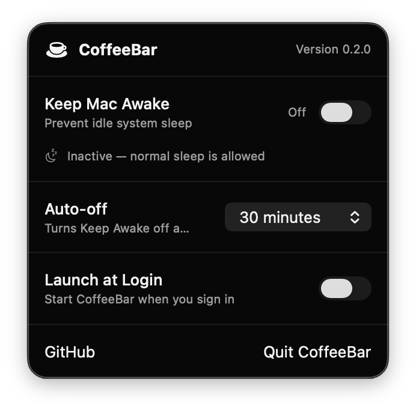

# CoffeeBar

<p align="center">
  
</p>

<p align="center"><strong>Keep your Mac awake while AI agents and long-running tasks finish.</strong></p>

<p align="center">
  <a href="https://github.com/carlosfachini/coffeebar/releases/latest"></a>
  
  <a href="https://github.com/carlosfachini/homebrew-tap"></a>
  <a href="LICENSE"></a>
</p>

CoffeeBar is a lightweight native macOS menu bar app that prevents idle system sleep while AI agents, builds, downloads, and other long-running tasks finish. It has no accounts or telemetry and never changes your power settings permanently.

<p align="center">
  
</p>

## Why CoffeeBar?

Long-running work can be interrupted when a Mac goes to sleep. CoffeeBar gives you one clear switch to keep the system awake only while you need it.

- One-click **Keep Mac Awake** control with auto-off after 30 minutes by default.
- Choose 30 minutes, 1 hour, or keep it on until manually disabled.
- Native menu bar experience with no permanent Dock icon.
- Clear active and inactive status.
- Optional **Launch at Login**, disabled by default.
- Universal app for Apple Silicon and Intel Macs.
- Daily update notice through GitHub Releases.
- No analytics, telemetry, accounts, or external runtime dependencies.

## Install

### Requirements

- macOS 14 Sonoma or later.
- Homebrew is optional and only required for terminal installation.

### Homebrew

```bash
brew install --cask carlosfachini/tap/coffeebar
```

Homebrew installs `CoffeeBar.app` in `/Applications`. Installation does not launch the app automatically.

### GitHub Releases

Download the latest universal ZIP from [GitHub Releases](https://github.com/carlosfachini/coffeebar/releases/latest), extract it, and move `CoffeeBar.app` to `/Applications`.

### First launch

CoffeeBar does not use a paid Apple Developer account, so its releases cannot be notarized. Gatekeeper may block the first launch even though the app is open source and its release checksum is published.

To approve the official build:

1. Open CoffeeBar once from `/Applications`.
2. When macOS blocks it, open **System Settings**.
3. Go to **Privacy & Security**.
4. Scroll to the CoffeeBar message and click **Open Anyway**.
5. Confirm **Open**.

Only override Gatekeeper for a build downloaded from this repository or installed through the official `carlosfachini/tap` Cask.

## Usage

1. Open CoffeeBar from Finder, Launchpad, or Spotlight.
2. Click the cup in the menu bar.
3. Enable **Keep Mac Awake** while work is running.
4. Choose the auto-off duration before or during the session. Select **Until turned off** for long-running work.
5. Disable it when normal idle sleep should resume.

The active panel shows **Active — idle sleep is blocked**, its scheduled auto-off time, and the menu bar cup gains a small badge. CoffeeBar always starts with Keep Awake inactive.

### Reopen CoffeeBar

Choosing **Quit CoffeeBar** removes its menu bar item. Open `/Applications/CoffeeBar.app` again to restore it.

### Launch at Login

Enable **Launch at Login** if CoffeeBar should return after signing in or restarting the Mac. This option is disabled by default.

## Updates

CoffeeBar checks GitHub at most once every 24 hours. When a newer version exists, the panel shows a link to its release. The check sends no account or usage information and never affects Keep Awake.

Upgrade a Homebrew installation with:

```bash
brew update
brew upgrade --cask carlosfachini/tap/coffeebar
```

CoffeeBar intentionally does not install updates automatically.

## How it works

CoffeeBar uses a native macOS activity to prevent idle system sleep only while Keep Awake is enabled. Keep Awake switches off automatically after its selected duration, or immediately when disabled or closed. Display sleep, screen locking, and manual sleep remain available.

## Privacy and security

- No analytics or telemetry.
- No accounts, login, cookies, or API keys.
- No background server or shell commands.
- No permanent changes to macOS power settings.
- One optional public GitHub request per day for version information.
- Release ZIPs include SHA-256 verification, and Homebrew validates the exact release checksum.

## Uninstall

```bash
brew uninstall --cask carlosfachini/tap/coffeebar
```

Remove app preferences and caches too:

```bash
brew uninstall --cask --zap carlosfachini/tap/coffeebar
```

If Launch at Login was enabled, disable it in CoffeeBar before uninstalling.

## Troubleshooting

### The cup disappeared

CoffeeBar was likely quit. Open `/Applications/CoffeeBar.app` again.

### macOS says the developer cannot be verified

Follow the [first-launch steps](#first-launch). This is expected because CoffeeBar is not notarized.

### Keep Awake is on but the display turns off

This is expected. CoffeeBar blocks idle **system** sleep, not display sleep or screen locking.

### No update notice appears

The check is cached for 24 hours and fails silently when GitHub is unavailable. Homebrew can check directly with `brew outdated --cask`.

## Contributing

Development and contribution instructions are available in [CONTRIBUTING.md](CONTRIBUTING.md).

## License

[MIT](LICENSE) © 2026 Carlos Fachini
